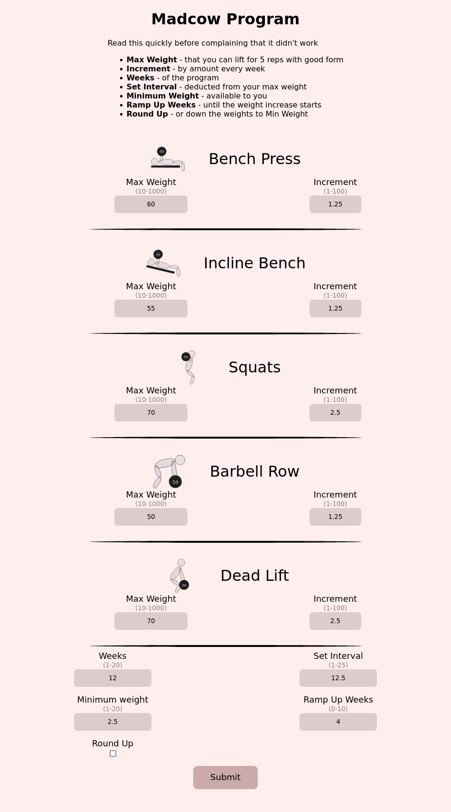
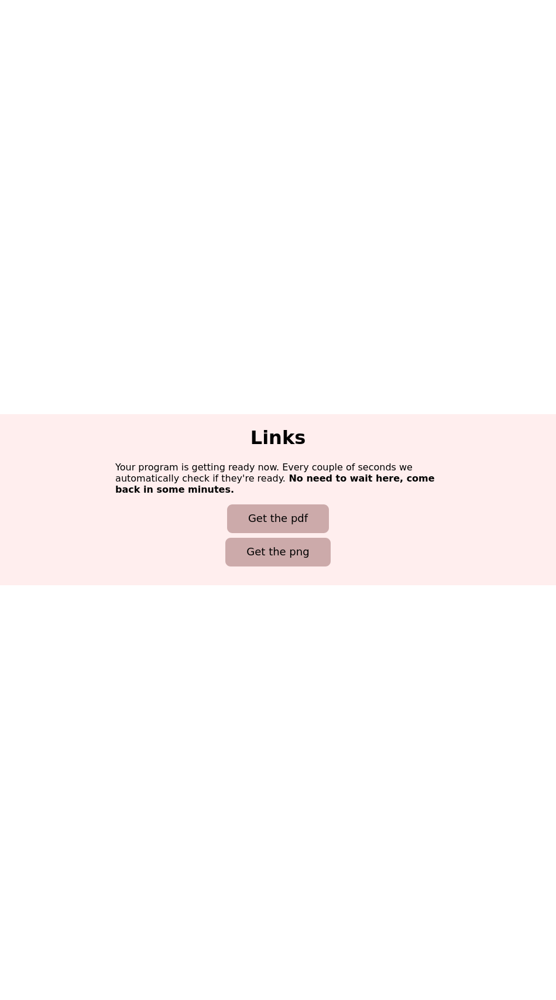
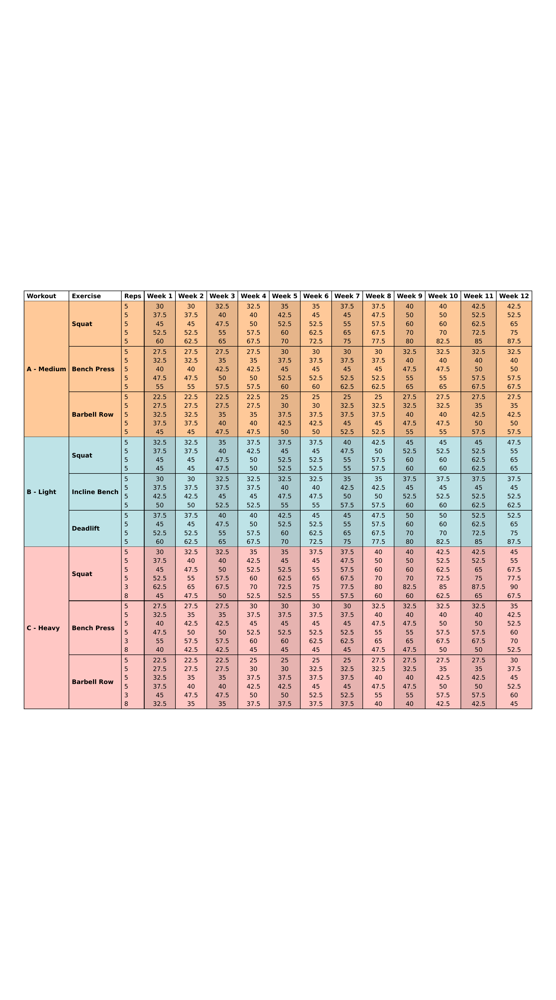

<div align="center">
<p align="center"> 
	
</p>
<h1 align="center">
Madcow Program
</h1>
</div>


<p align="center">
Generate a Madcow program in a matter of seconds.
</p>

## Screenshots

<div>



</div>

## Tech used

- **Typst** - pdf generation

- **React & next.js** - front end SPA

- **Gofiber** - blazing fast backend

- **Poppler-utils** - pdf -> png

## Build

### Prerequisites

- The nix package manager

or:

- The go toolchain

- Yarn / NPM

- Poppler-utils

- Typst

### Running

If using nix run:

```
nix-shell --pure
```

which will get you a complete build/dev environment ready.

To start the service:

```
cd site
yarn build
#Copy the files from site/dist to server/static/public
#Change dir into project's root
cd server
go run .
```

Access the site at localhost:8080 (port can be changed on main.go).

<details>
  <summary>&#9888;&#65039;<b>Important</b>&#9888;&#65039;</summary>
  
  Enjoy :)
</details>

### Development

Starting the nextjs dev environment:

```
cd site/
yarn dev
```

Make the changes visible on the server:

```
yarn build
#Copy the files from site/dist to server/static/public
```

## Source

This program is implemented following the Madcow guides on [the StrongLifts website](https://stronglifts.com/madcow-5x5/).


## Contact

Email me.


# Licensing

## Source Code

Copyright (C) simplicity-load

This program is free software: you can redistribute it and/or modify it under the terms of the GNU Affero General Public License as published by the Free Software Foundation, either version 3 of the License, or (at your option) any later version.

This program is distributed in the hope that it will be useful, but WITHOUT ANY WARRANTY; without even the implied warranty of MERCHANTABILITY or FITNESS FOR A PARTICULAR PURPOSE. See the GNU Affero General Public License for more details.

You should have received a copy of the GNU Affero General Public License along with this program. If not, see https://www.gnu.org/licenses/.

## Images and Graphics

[Creative Commons Attribution 4.0 International (CC BY-NC-SA 4.0)](https://creativecommons.org/licenses/by-nc-sa/4.0/).
